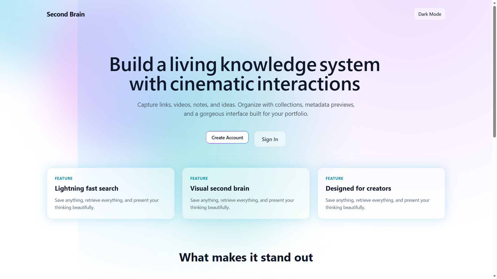
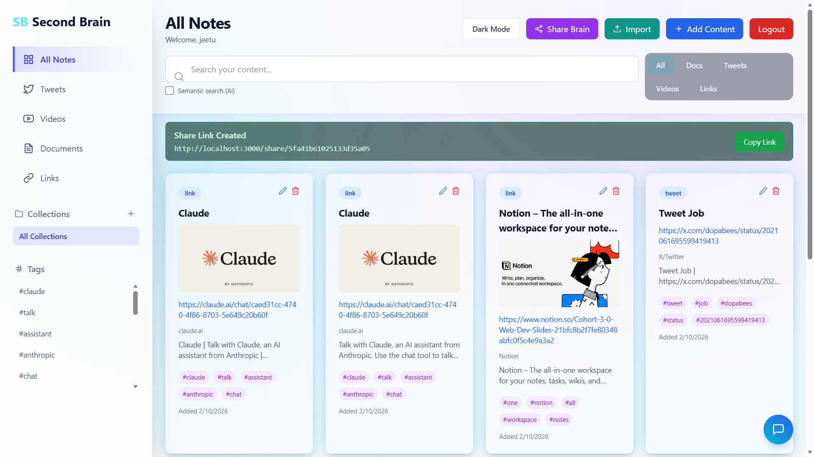
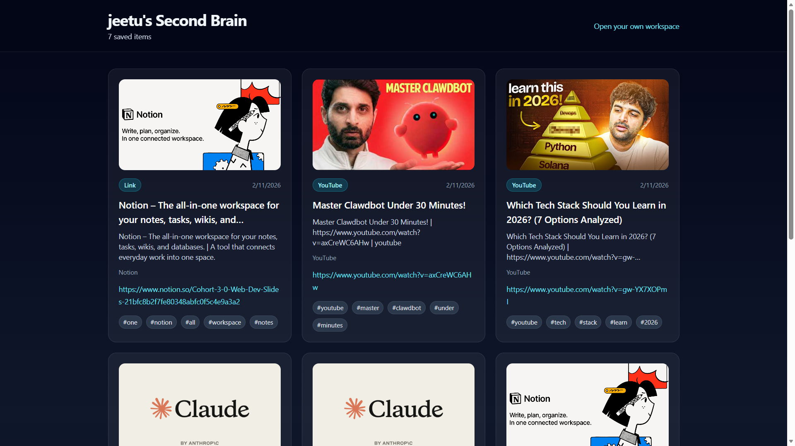

# Second Brain

A full-stack knowledge management app to capture links, videos, docs, and tweets, organize them with tags and collections, and search everything with both keyword and semantic AI search.

## Screenshots

### Landing Page


### Dashboard (Light)


### Shared Brain / Portfolio View (Dark)


## Highlights

- Personal knowledge hub with authentication and protected dashboard
- Save content as `document`, `tweet`, `youtube`, or `link`
- Auto metadata extraction (title, description, domain, preview image)
- Collections + tag system for clean organization
- AI-powered features with Hugging Face + Mongo cache
- Semantic vector search with fallback strategy when AI limits are hit
- AI chat over your saved notes (RAG-style retrieval)
- Public shareable brain links
- Bulk import via JSON/CSV
- Responsive UI with dark mode and animated components

## Tech Stack

- Frontend: React 19, TypeScript, Tailwind CSS, Framer Motion, React Router
- Backend: Node.js, Express 5, TypeScript
- Database: MongoDB + Mongoose
- Auth: JWT + bcrypt
- AI: Hugging Face Inference API + deterministic local fallbacks

## Project Structure

```text
second-brain-app/
|- backend/
|  |- src/
|  |  |- routes/
|  |  |- models/
|  |  |- utils/
|- frontend/
|  |- src/
|  |  |- pages/
|  |  |- components/
|  |  |- utils/
|- assets/
|  |- screenshots/
|- README.md
```

## Local Setup

### 1. Clone and install

```bash
git clone <your-repo-url>
cd second-brain-app

cd backend
npm install

cd ../frontend
npm install
```

### 2. Configure environment variables

Backend (`backend/.env`):

```env
PORT=3000
MONGO_URI=mongodb://localhost:27017/second-brain
JWT_SECRET=replace-with-a-long-random-secret
CORS_ORIGIN=http://localhost:3001
PUBLIC_API_BASE_URL=http://localhost:3000/api/v1
PUBLIC_APP_BASE_URL=http://localhost:3001
RATE_LIMIT_WINDOW_MS=900000
RATE_LIMIT_MAX=300

HF_API_TOKEN=hf_xxx_your_free_token
HF_API_URL=https://router.huggingface.co/hf-inference/models
HF_TAG_MODEL=facebook/bart-large-mnli
HF_SUMMARY_MODEL=facebook/bart-large-cnn
HF_EMBEDDING_MODEL=BAAI/bge-small-en-v1.5
HF_TIMEOUT_MS=20000
AI_CACHE_TTL_HOURS=336
AI_DUPLICATE_THRESHOLD=0.88
```

Frontend (`frontend/.env`):

```env
REACT_APP_API_BASE_URL=http://localhost:3000/api/v1
REACT_APP_PUBLIC_APP_BASE_URL=http://localhost:3001
```

### 3. Run the app

Terminal 1:

```bash
cd backend
npm run dev
```

Terminal 2:

```bash
cd frontend
npm start
```

App URLs:
- Frontend: `http://localhost:3001`
- Backend API: `http://localhost:3000/api/v1`

## Core API Endpoints

Auth:
- `POST /api/v1/signup`
- `POST /api/v1/signin`

Content:
- `GET /api/v1/content`
- `POST /api/v1/content`
- `DELETE /api/v1/content`
- `GET /api/v1/content/preview`
- `POST /api/v1/content/import`
- `POST /api/v1/content/ai/suggest`
- `GET /api/v1/content/ai/search`
- `POST /api/v1/content/ai/chat`

Collections:
- `GET /api/v1/collections`
- `POST /api/v1/collections`
- `PATCH /api/v1/collections/:collectionId`
- `DELETE /api/v1/collections/:collectionId`

Sharing:
- `POST /api/v1/brain/share`
- `GET /api/v1/brain/:shareLink`

## Deployment Notes

- Set `CORS_ORIGIN` to your frontend domain.
- Set `PUBLIC_API_BASE_URL` to your backend public API URL.
- Set `PUBLIC_APP_BASE_URL` to your frontend public URL.
- In frontend, set `REACT_APP_API_BASE_URL` and `REACT_APP_PUBLIC_APP_BASE_URL` for the deployed domains.

## Useful Docs

- Free AI setup guide: `FREE_AI_SETUP.md`
- Release checklist: `RELEASE_CHECKLIST.md`
- Testing checklist: `TESTING_CHECKLIST.md`

## License

MIT
